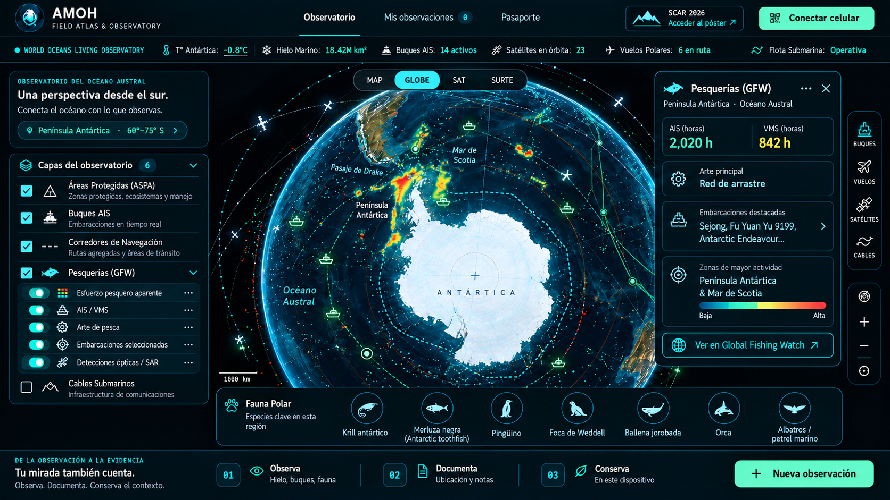

🧊 Antarctic Maritime Observation Hub — AMOH
<p align="center">
  <strong>WORLD OCEANS LIVING OBSERVATORY</strong><br>
  <em>Field Atlas · Live Ocean Intelligence · Antarctic Expeditions · Scientific Passport</em>
</p>

<p align="center">
  
</p>

<p align="center">
  
  
  
  
  
  
  
  
</p>

<p align="center">
  <a href="./Antarctic_Maritime_Hub_compressed.mp4"><strong>▶ Watch AMOH Demo</strong></a>
  &nbsp;&nbsp;·&nbsp;&nbsp;
  <a href="https://virtual.oxfordabstracts.com/event/75327/poster-gallery/grid?sort=titles&current=1820"><strong>SCAR 2026 Poster ↗</strong></a>
</p>

<p align="center">
  <strong>Observe · Document · Understand · Preserve</strong>
</p>

---

## 🌊 What is AMOH?

**AMOH — Antarctic Maritime Observation Hub** is an experimental, map-first geospatial observatory for **Antarctica and the Southern Ocean**.

It is being developed as a **World Oceans Living Observatory** capable of connecting maritime activity, fisheries, satellite observations, Earth-system science, biodiversity, Antarctic expeditions, mobile field observations, scientific provenance and local artificial intelligence inside a unified spatial interface.

AMOH is not intended to be another static dashboard.

The goal is to create a **living scientific record of the Southern Ocean**, where observations can preserve their full context:

- where they happened;
- when they happened;
- which source produced them;
- how precise they are;
- what method generated them;
- whether they have been reviewed;
- what evidence supports them;
- and how they relate to other observations.

AMOH was initiated by **Juan Sebastian Huertas Olea** as an independent research and development project focused on Antarctic observation, open science, expedition continuity, scientific participation and the relationship between humanity and the ocean.

---

## 🇨🇴 Resumen en español

**AMOH — Antarctic Maritime Observation Hub** es un observatorio digital experimental para integrar, visualizar y documentar evidencia del **Océano Austral y la Antártida** desde una sola plataforma.

El proyecto busca conectar:

- actividad marítima;
- AIS;
- pesca;
- satélites;
- hielo marino;
- biodiversidad;
- ciencia del Sistema Tierra;
- observaciones de campo;
- expediciones;
- teléfonos y sensores;
- inteligencia artificial;
- cartografía científica;
- y procedencia de datos.

La plataforma está diseñada para operar normalmente conectada a Internet, pero sus funciones de **campo y expedición** pueden continuar en redes locales o sin conexión pública.

---

# 🌐 World Oceans Living Observatory

> **One connected ocean. Evidence to understand it.**

AMOH begins with Antarctica and the Southern Ocean, but its long-term concept is broader:

```text
OCEAN
+
SATELLITES
+
VESSELS
+
FISHERIES
+
BIODIVERSITY
+
FIELD OBSERVATIONS
+
EXPEDITIONS
+
SCIENTIFIC DATA
+
ARTIFICIAL INTELLIGENCE
+
HUMAN PARTICIPATION
```

The objective is not simply to collect more data.

The objective is to connect evidence while preserving:

```text
SOURCE
TIME
LOCATION
PRECISION
QUALITY
METHOD
LICENSE
PROVENANCE
REVIEW STATE
```

---

# 🚧 Project status

AMOH is currently an:

```text
ACTIVE RESEARCH PROTOTYPE
```

Not every provider, API or module described in this repository is necessarily enabled in every installation.

Availability depends on:

- API access;
- licenses;
- credentials;
- permissions;
- data-provider policies;
- Internet availability;
- field-network availability;
- scientific datasets;
- local configuration.

AMOH explicitly distinguishes between real observations, delayed information, historical records, simulations and demonstration data.

---

# 🟢 Data states

| State | Meaning |
|---|---|
| `LIVE` | Current according to the provider and its declared latency |
| `DELAYED` | Recent information that is not real-time |
| `RECENT` | Recent observation inside a defined period |
| `HISTORICAL` | Historical record |
| `STALE` | Older than its expected refresh window |
| `OFFLINE` | Provider or connection unavailable |
| `SIMULATION` | Model-generated result |
| `DEMO` | Synthetic demonstration data |
| `UNREVIEWED` | Submitted evidence not yet scientifically reviewed |
| `UNDER_REVIEW` | Evidence currently under review |
| `VALIDATED` | Scientifically reviewed under a defined workflow |
| `REJECTED` | Reviewed and rejected |
| `NOT_CONFIGURED` | Adapter exists but its provider is not configured |

AMOH must never present `DEMO`, `SIMULATION`, historical or unavailable data as `LIVE`.

---

# 🔬 Scientific principle

AMOH follows one essential rule:

> **Observation ≠ Causation**

Spatial or temporal coincidence between:

- a vessel;
- AIS activity;
- a satellite detection;
- fishing activity;
- a whale sighting;
- sea-ice variation;
- a field observation;
- an environmental anomaly;

does **not automatically demonstrate**:

- causality;
- environmental impact;
- illegal activity;
- intent;
- responsibility.

AMOH supports investigation and evidence reconciliation.

It does not manufacture conclusions.

---

# 🗺️ Live Lens

**Live Lens** is the main AMOH workspace.

The map is the product.

The interface is designed so that Antarctica and the Southern Ocean remain visually dominant while controls and analytical panels appear only when requested.

### Map modes

```text
MAP
GLOBE
SAT
SURIE
```

AMOH intentionally avoids loading multiple heavy globe engines at startup.

The home experience uses a single primary geospatial renderer.

---

# 🌍 Antarctic Globe

The primary globe is oriented toward the Southern Hemisphere.

Main geographic areas include:

- Antarctica;
- Antarctic Peninsula;
- Drake Passage;
- Scotia Sea;
- South Shetland Islands;
- Southern Ocean;
- sub-Antarctic gateways.

The interface can progressively display:

```text
VESSELS
FLIGHTS
SATELLITES
FISHERIES
FAUNA
PROTECTED AREAS
SUBMARINE CABLES
SCIENCE DATA
TOURISM
FIELD OBSERVATIONS
EXPEDITION DATA
```

---

# 🎛️ Spatial intelligence filters

AMOH uses a compact filter system inspired by modern open-source geospatial-intelligence interfaces.

The interaction language emphasizes:

- map-first navigation;
- semantic zoom;
- spatial filtering;
- entity selection;
- density visualization;
- viewport-aware loading;
- lightweight contextual drawers.

### Main filters

#### 🚢 Vessels

Possible categories:

```text
Research
Tourism
Fishing
Logistics
Icebreakers
Support vessels
```

#### ✈️ Flights

Regional aviation context where authorized public data is available.

#### 🛰️ Satellites

Relevant passes rather than the entire global satellite population.

Possible categories:

```text
Earth observation
Communications
Weather
Navigation
Research
```

#### 🐟 Fisheries

Fishing activity and marine-resource context.

#### 🐋 Fauna

Marine biodiversity and Antarctic wildlife.

#### 〰️ Submarine infrastructure

Public subsea cable and communications context.

---

# 🔭 Semantic zoom

AMOH changes the representation according to scale.

| Scale | Visualization |
|---|---|
| Global | density, clusters, aggregated context |
| Regional | categories, corridors, hotspots |
| Local | individual entities, tracks and evidence |

This avoids rendering tens of thousands of unnecessary individual objects.

---

# 🚢 AIS & maritime activity

AMOH can normalize maritime observations using fields such as:

```text
mmsi
vessel_name
vessel_type
timestamp_utc
latitude
longitude
speed_knots
course_deg
source
quality
geom
```

Potential analyses include:

- vessel tracks;
- maritime corridors;
- vessel density;
- route concentration;
- speed changes;
- signal gaps;
- voyage replay;
- field-observation matchups;
- tourism context;
- fisheries context;
- research-vessel activity.

### Critical rule

```text
AIS absence ≠ vessel absence
```

An AIS gap cannot by itself prove disappearance, illegal activity or deliberate transponder deactivation.

---

# 🎣 Global Fishing Watch

AMOH is designed to integrate selected **Global Fishing Watch — GFW** data products when access, licensing and configuration allow.

Potential layers include:

- apparent fishing effort;
- AIS activity;
- VMS activity;
- vessel presence;
- fishing gear;
- vessel encounters;
- loitering;
- AIS gaps;
- port visits;
- optical detections;
- SAR detections;
- night-light detections.

Queries should be constrained by:

```text
VIEWPORT
+
TIME PERIOD
+
ACTIVE PRODUCT
```

instead of loading unnecessary global datasets.

---

## ⚠️ Fishing activity ≠ illegal fishing

AMOH does not automatically classify a vessel as illegal because of:

- apparent fishing activity;
- AIS gaps;
- SAR detection;
- vessel encounters;
- loitering;
- proximity to a protected area;
- activity hotspots.

These are signals that may require additional investigation.

Legal determinations require appropriate evidence and competent authorities.

---

# 🐋 Polar Fauna

AMOH includes a **Polar Fauna** interface for exploring species observations and biodiversity datasets.

Initial species groups include:

### 🦐 Antarctic krill

A central component of the Southern Ocean food web.

### 🐟 Antarctic toothfish

Relevant to Antarctic ecosystem and fisheries science.

### 🐧 Penguins

Observation records can be connected with sea ice, tourism, fisheries and environmental variables.

### 🦭 Weddell seal

Marine mammal records can be explored alongside environmental conditions.

### 🐋 Humpback whale

Possible evidence can include:

- sightings;
- acoustic records;
- tags;
- field observations;
- historical records.

### Orca

Observations can be represented individually or as aggregated scientific evidence.

### Albatrosses and petrels

Seabird records can be connected with marine and fisheries context.

---

# 🧬 Biodiversity sources

Potential adapters include:

```text
OBIS
GBIF
IWC
CCAMLR
SCAR datasets
SOOS
AMOH Field
```

Each record should preserve:

```text
scientific_name
common_name
source
dataset
observed_at_utc
latitude
longitude
coordinate_precision
quality
review_state
license
retrieved_at
```

---

# 🦐 Krill Intelligence

A dedicated krill context can compare:

```text
KRILL
+
SEA ICE
+
WHALES
+
PENGUINS
+
SEALS
+
FISHERIES
+
OCEAN CONDITIONS
```

Spatial overlap can help identify monitoring priorities.

It does not establish ecological causality by itself.

---

# 🛰️ Satellite observations

AMOH can integrate satellite observations relevant to Antarctica.

Potential products include:

- Sentinel-1 SAR;
- Sentinel-2 optical imagery;
- Copernicus products;
- Earth Engine analyses;
- sea-ice observations;
- ocean-colour products;
- atmospheric products;
- night lights;
- vessel detections.

Every satellite observation should preserve, where available:

```text
source
satellite
sensor
acquisition_time
processing_time
resolution
quality
license
```

Satellite information must not automatically be labelled as real-time.

---

# 🌍 Earth Sciences

AMOH groups Earth-system observations into:

```text
ATMOSPHERE
OCEAN
CRYOSPHERE
LAND / COAST
BIOSPHERE
GEOPHYSICS
REMOTE SENSING
```

Potential outputs include:

- maps;
- time series;
- statistics;
- scenes;
- methodology;
- source;
- quality;
- uncertainty.

Analytical jobs may use:

```text
QUEUED
PROCESSING
COMPLETED
FAILED
CANCELLED
```

AMOH should never show fake progress when a remote provider does not expose real processing progress.

---

# 🧊 Quantarctica

AMOH is designed to connect with **Quantarctica** as an important Antarctic scientific-data environment.

Potential layers include:

- topography;
- bathymetry;
- glaciers;
- ice shelves;
- geology;
- research stations;
- protected areas;
- biological context;
- environmental management;
- infrastructure.

For browser performance AMOH should prefer optimized representations such as:

```text
PMTiles
MVT
COG
raster tiles
```

rather than loading full desktop GIS datasets directly into the browser.

---

## Offline Quantarctica packages

During an expedition, users may define:

```text
REGION
ROUTE CORRIDOR
FIELD SITES
LAYERS
RESOLUTION
```

and prepare a limited offline science package before departure.

---

# 🗺️ ArcGIS SURIE

AMOH supports on-demand comparison with the ArcGIS SURIE WebMap.

```text
WebMap ID:
de8bb6821bf148649f1e7b9154592a97
```

Potential comparison modes:

```text
SIDE BY SIDE
SWIPE
LINKED EXTENT
```

SURIE is loaded only when requested.

It is not required for AMOH startup.

---

# 🌐 Submarine cables

AMOH differentiates:

```text
SUBMARINE CABLES
```

from:

```text
SUBMARINES
```

These are not equivalent.

Public infrastructure records may include:

```text
cable_name
operator
landing_points
status
route_precision
source
retrieved_at
```

AMOH should never fabricate confidential or undocumented subsea infrastructure.

---

# 📡 Connectivity

AMOH can document connectivity conditions during expeditions.

Potential context:

- ship Wi-Fi;
- research-station networks;
- satellite Internet;
- Starlink where authorized;
- local LAN;
- cellular signal where available;
- latency;
- packet loss;
- offline periods.

The goal is to understand field connectivity.

It is not to identify or surveil individuals.

AMOH does not require:

```text
IMEI
IMSI
Advertising ID
```

as scientific device identifiers.

---

# 📸 DJI & aerial observations

AMOH can ingest DJI imagery and extract EXIF/XMP information.

Potential metadata:

```text
GPS latitude
GPS longitude
GPS altitude
relative altitude
pitch
roll
yaw
camera model
focal length
image width
timestamp
file hash
```

---

## Ground Sample Distance — GSD

When physical sensor width is known:

```text
GSD = (Sw × H × 100) / (Fr × ImW)
```

Where:

```text
Sw  = sensor width in mm
H   = height above terrain in metres
Fr  = focal length in mm
ImW = image width in pixels
```

Result:

```text
GSD = centimetres / pixel
```

AMOH must never invent camera sensor width.

If it cannot be reliably determined:

```text
GSD = UNAVAILABLE
```

---

# 📱 AMOH Field Connect

**AMOH Field Connect** transforms phones and tablets into voluntary observation nodes.

The PWA can capture, when supported and explicitly permitted:

- GPS;
- location accuracy;
- altitude;
- heading;
- speed;
- camera;
- photographs;
- timestamp;
- device orientation;
- motion;
- notes;
- network status.

Observations can remain local when the device loses Internet access.

---

## Offline observation states

```text
LOCAL
↓
QUEUED
↓
SYNCING
↓
SERVER_RECEIVED
↓
UNDER_REVIEW
↓
APPROVED / REJECTED
```

Failure state:

```text
FAILED
```

---

# 📲 Connecting phones by QR

Inside a ship or expedition LAN, AMOH can generate a QR pointing to the actual local address.

Correct:

```text
http://192.168.x.x:5174/
```

Incorrect:

```text
localhost
127.0.0.1
0.0.0.0
```

A backend endpoint can provide:

```text
GET /api/network-info
```

to resolve the active LAN address.

---

# 📱 Android Field Node

An optional native Android application can extend browser capabilities.

Potential technologies:

```text
Kotlin
Jetpack Compose
Fused Location Provider
SensorManager
Nearby Connections
Local encrypted storage
```

Potential sensors:

- accelerometer;
- gyroscope;
- magnetometer;
- rotation vector;
- barometer;
- ambient light;
- location;
- battery;
- network.

AMOH discovers what hardware actually exists on the device.

It does not assume every phone contains every sensor.

---

## Sensor profiles

```text
ECO
SURVEY
BURST
```

### ECO

Battery-efficient contextual monitoring.

### SURVEY

Moderate sampling during an active field session.

### BURST

Short-duration higher-frequency collection when scientifically justified.

`BURST` should never remain active indefinitely.

---

# 🚢 Expeditions

The `/expeditions` area converts AMOH into a continuity platform for scientific campaigns.

Core model:

```text
EXPEDITION
    ↓
VOYAGE
    ↓
FIELD SESSION
    ↓
DEVICE
    ↓
OBSERVATION
    ↓
EVIDENCE
    ↓
MATCHUP
    ↓
SCIENTIFIC REVIEW
    ↓
VALIDATED OUTPUT
    ↓
PASSPORT
```

---

# 🟨 NGS–Lindblad Visiting Scientist research concept

AMOH includes a research workspace prepared around a proposal concept for the:

```text
NGS–Lindblad Expeditions
Visiting Scientist Program
Southern Ocean 2027–2028
```

Research concept:

> **Where and when does maritime activity concentrate along the Antarctic Peninsula, and can AIS, satellite observations and field validation help identify where closer environmental monitoring is most needed?**

Method:

```text
AIS
+
SATELLITE
+
FIELD
↓
MATCH
↓
REVIEW
↓
OUTPUT
```

Unless formally confirmed, this workspace remains:

```text
PROPOSAL
```

Its presence in AMOH does **not** imply selection, funding, endorsement or partnership by National Geographic or Lindblad Expeditions.

---

# 🇨🇴 Programa Antártico Colombiano

AMOH is also being designed to support expedition workflows related to the **Programa Antártico Colombiano — PAC**.

The architecture allows successive expedition cycles without hardcoding a single year.

Potential lifecycle:

```text
CALL
↓
APPLICATION
↓
EVALUATION
↓
SELECTION
↓
PREPARATION
↓
PRE-ANTARCTIC TRAINING
↓
MEDICAL / ADMINISTRATIVE READINESS
↓
LOGISTICS
↓
DEPLOYMENT
↓
FIELD SCIENCE
↓
RETURN
↓
REPORTING
↓
SCIENTIFIC PRODUCTS
↓
LESSONS LEARNED
↓
ARCHIVE
```

AMOH distinguishes between:

```text
PROPOSAL
SELECTED
PLANNING
READY
ACTIVE
RETURNING
REPORTING
COMPLETED
ARCHIVED
```

A proposal must never automatically appear as a completed expedition.

---

# 🔬 Science Hub

Each expedition may expose an **AMOH Science Hub** through QR.

Potential contributor types:

```text
RESEARCHER
EXPEDITION STAFF
GUEST / COMMUNITY
```

Scientific contribution workflow:

```text
SUBMIT
↓
REVIEW
↓
MATCH
↓
USE
```

No submission becomes validated science automatically.

---

# 🧪 Scientific Matchups

AMOH can reconcile:

```text
FIELD OBSERVATION
+
AIS
+
SATELLITE
+
ENVIRONMENTAL CONTEXT
```

Possible outcomes:

```text
MATCH
PARTIAL_MATCH
NO_MATCH
DATA_GAP
CONFLICT
```

A disagreement between sources is scientifically useful information and should be preserved.

---

# 🪪 Antarctic Scientific Passport

The **AMOH Antarctic Scientific Passport** is an interactive scientific identity and participation record.

> **Prototype scientific passport. It is not a travel document.**

The Passport can connect:

- expeditions;
- field sessions;
- validated observations;
- routes;
- scientific stamps;
- datasets;
- publications;
- credentials;
- achievements;
- scientific participation.

---

## Passport philosophy

The Passport answers:

```text
Where have I been?

What have I observed?

What has been validated?

What have I contributed?

What science am I connected to?

What can I do next?
```

It does not replace:

- a legal passport;
- visa;
- government ID;
- expedition permit;
- institutional credential.

---

# 💳 AMOH Scientific Smart Card

AMOH can represent a digital or physical scientific credential.

Potential capabilities:

```text
QR verification
NFC
public-key challenge
selected public claims
credential revocation
```

It is not intended to imitate an official government travel document.

---

# 🌐 World ID

World integration is optional.

AMOH separates:

```text
AMOH ACCOUNT
WORLD PROOF OF HUMAN
SCIENTIFIC ROLE
INSTITUTIONAL ROLE
SCIENTIFIC VALIDATION
```

These concepts are not equivalent.

World verification does not establish:

- academic qualification;
- scientific competence;
- institutional affiliation;
- quality of evidence.

AMOH does not need to store biometric information.

---

# 💰 Optional WLD scientific rewards

AMOH is exploring a model in which scientifically validated contributions may become eligible for funded incentives.

Potential workflow:

```text
MISSION COMPLETE
↓
SUBMISSION
↓
SCIENTIFIC REVIEW
↓
APPROVED
↓
REWARD ELIGIBILITY
↓
WORLD VERIFICATION
↓
ANTI-FRAUD
↓
BUDGET CHECK
↓
AUTHORIZED
↓
PROCESSING
↓
WORLD WALLET
↓
CONFIRMED
```

Possible reward states:

```text
NOT_ELIGIBLE
PENDING_SCIENTIFIC_REVIEW
ELIGIBLE
PENDING_WORLD_VERIFICATION
AUTHORIZED
PROCESSING
PAID
FAILED
REVOKED
```

Critical rule:

```text
PENDING ≠ PAID
```

Only an observation that passes the configured scientific-review process may advance toward reward eligibility.

AMOH is not a cryptocurrency trading application.

---

# 🧠 Pythia

**Pythia** is AMOH's local analytical intelligence layer.

Target local endpoint:

```text
http://localhost:8088
```

Possible local inference environment:

```text
Ollama
llama3.1
qwen3
```

---

## Swarm Council

AMOH currently explores four analytical roles.

### 🧊 Ice Navigator

Focus:

- sea ice;
- cryosphere;
- route context;
- navigational environment.

### 🐋 Marine Biologist

Focus:

- biodiversity;
- whales;
- krill;
- ecosystem context.

### 🚢 Naval Strategist

Focus:

- maritime patterns;
- AIS;
- logistics;
- route activity.

This role is intended for non-operational analytical context.

### 🔎 Skeptic

Focus:

- uncertainty;
- contradictory evidence;
- weak assumptions;
- false positives.

---

# ⚠️ AI Analysis

Every Pythia result should be clearly identified as:

```text
AI ANALYSIS
```

Relevant outputs should be able to expose:

```text
evidence IDs
source
time
location
assumptions
limitations
```

Artificial intelligence does not replace scientific validation.

---

# 📈 Brier weighting

For verifiable probabilistic forecasts:

```text
BS_i = (1/N) × Σ(f_i,t - o_t)²
```

Agent weight:

```text
W_i = (1 - BS_i)² / Σ(1 - BS_j)²
```

Tests should include:

```text
perfect prediction
poor prediction
equal agents
missing data
single agent
```

---

# 🔮 Forecast Rings

Experimental horizons:

```text
24H
1W
1M
1Y
```

Every Forecast Ring should expose:

```text
SIMULATION
generated_at
model
horizon
assumptions
evidence
limitations
```

A simulation must never be presented as an observation.

---

# 🐟 MiroFish

AMOH can connect with **MiroFish** as a prospective simulation engine.

Workflow:

```text
01 / Ontology Generation
02 / Graph Construction
03 / Parallel Simulation
04 / Report Generation
05 / Deep Interaction
```

AMOH should connect through an adapter rather than unnecessarily reimplementing the existing engine.

---

# 🗄️ Local Data Fabric

AMOH uses **DuckDB Spatial** as a lightweight local geospatial analytical engine.

Connected provisioning:

```sql
INSTALL spatial;
```

Runtime:

```sql
LOAD spatial;
```

During offline field operations the extension should already be provisioned.

AMOH must not silently attempt to download it while disconnected.

---

## Vessel tracks

```sql
CREATE TABLE vessel_tracks (
    mmsi VARCHAR,
    vessel_name VARCHAR,
    vessel_type VARCHAR,
    timestamp TIMESTAMP,
    speed_knots DOUBLE,
    course_deg DOUBLE,
    geom GEOMETRY,
    dark_vessel_flag BOOLEAN DEFAULT FALSE
);
```

---

## Passport claims

```sql
CREATE TABLE passport_claims (
    claim_id UUID PRIMARY KEY,
    nullifier_hash VARCHAR,
    investigator_did VARCHAR,
    observation_type VARCHAR,
    timestamp TIMESTAMP,
    location GEOMETRY,
    status VARCHAR,
    reward_wld_amount DOUBLE DEFAULT 0
);
```

---

## Forecast rings

```sql
CREATE TABLE forecast_rings (
    ring_id UUID PRIMARY KEY,
    horizon_code VARCHAR,
    confidence_score DOUBLE,
    prophecy_text TEXT,
    center_geom GEOMETRY,
    radius_meters DOUBLE
);
```

---

# 📊 Scientific visualization

AMOH follows three simple visualization rules.

## Missing data ≠ zero

Missing values should create gaps rather than artificial zero measurements.

## Tooltips preserve provenance

Relevant points and series should expose:

```text
value
unit
UTC
source
quality
evidence
```

## Evidence differs from simulation

Suggested visual language:

```text
OBSERVED      continuous
INTERPOLATED  dashed
SIMULATION    visually distinct
```

---

# 🧳 Antarctic tourism

AMOH may incorporate public information related to Antarctic tourism.

Potential layers:

- operators;
- published routes;
- landing areas;
- seasonal intensity;
- vessel activity;
- published future itineraries.

The system should distinguish:

```text
OBSERVED ROUTE
PUBLISHED ROUTE
PLANNED ROUTE
SCENARIO
```

A future scenario must never be displayed as a confirmed voyage.

---

# ⚖️ Antarctic governance & oceanopolitics

AMOH may integrate public-source context related to:

- Antarctic Treaty System;
- protected areas;
- scientific cooperation;
- logistics;
- tourism;
- fishing;
- environmental governance;
- international collaboration;
- infrastructure;
- connectivity.

This area is intended for scientific, diplomatic and public-policy analysis.

It is not intended for:

- targeting;
- hostile scoring;
- surveillance of individuals;
- operational military guidance.

---

# ☢️ Radiological & pollution legacy

Future AMOH layers may document public datasets concerning:

- historical nuclear tests;
- reactor accidents;
- documented industrial releases;
- radioactive residues;
- marine radionuclides;
- pollution;
- warming;
- acidification.

Historical events must remain distinct from contemporary measurements.

A historical release does not automatically prove current contamination at the same location.

---

# 🎥 Cameras & remote observation

AMOH can display authorized or public cameras when an actual stream is configured.

Camera metadata may include:

```text
operator
location
status
timestamp
permissions
source
```

A generic image must never be presented as a live feed.

Automated detections begin as:

```text
UNREVIEWED
```

---

# 🎨 Ocean art & culture

AMOH may include an optional art-science gallery connecting:

- Antarctic photography;
- ocean photography;
- expedition art;
- scientific visualization;
- augmented reality;
- environmental storytelling.

Every work should preserve:

```text
author
title
date
source
license / permission
credit
```

AMOH should not republish third-party artwork without appropriate permission.

---

# 💡 Grants & opportunities

AMOH may include an AI-assisted opportunity-matching layer.

Potential schema:

```text
opportunity
organization
theme
region
deadline
eligibility
funding
source
status
matched_need
```

AI may help identify relationships between scientific needs and funding opportunities.

Final eligibility must always be verified at the official source.

---

# ⚡ Performance philosophy

AMOH is designed to remain lightweight.

Target home:

```text
1 MapLibre instance
1 WebGL context
minimal default layers
```

The home should not preload:

```text
full Global Fishing Watch analytics
full Quantarctica package
ArcGIS SDK
Passport bundle
Expeditions bundle
World SDK
MiroFish
large charts
art gallery
grant engine
```

These modules should be loaded when requested.

---

# 📉 Performance metrics

Development builds should monitor:

```text
initial requests
MB transferred
map ready time
time to interactive
FPS
WebGL contexts
MapLibre sources
MapLibre layers
visible entities
memory use
```

Optimization should be measured rather than assumed.

---

# 🔐 Security

AMOH follows a defensive-security model.

Application controls may include:

- parameterized SQL;
- input validation;
- XSS protection;
- restrictive CORS;
- CSRF protection where applicable;
- role-based authorization;
- rate limiting;
- Host validation;
- DNS-rebinding protection;
- signed device-pairing challenges.

---

## File uploads

Validate:

```text
MIME type
extension
size
magic bytes
safe filename
safe destination
hash
```

---

## LAN security

A local ship network is not automatically trusted.

AMOH should continue authenticating users and devices.

---

## Defensive testing

Security testing follows defensive methodologies such as OWASP WSTG against AMOH-owned or explicitly authorized environments only.

---

# 🏗️ Architecture

```text
┌───────────────────────────────────────────────────────────────┐
│                            AMOH                               │
│                  WORLD OCEANS LIVING OBSERVATORY             │
├───────────────────────────────────────────────────────────────┤
│                         LIVE LENS                             │
│                   MAP · GLOBE · SAT · SURIE                  │
│                                                               │
│ Vessels · Flights · Satellites · Fisheries · Fauna · Cables  │
└───────────────────────────────┬───────────────────────────────┘
                                │
                         AMOH DATA FABRIC
                                │
           ┌────────────────────┼────────────────────┐
           │                    │                    │
           ▼                    ▼                    ▼
    ONLINE ADAPTERS        FIELD / EDGE        SCIENCE LAYERS
    AIS / GFW / APIs       PWA / Android       Quantarctica
    Satellite / Weather    DuckDB / LAN        SURIE / COG/MVT
           │                    │                    │
           └────────────────────┼────────────────────┘
                                ▼
                     PROVENANCE + REVIEW
                                │
               ┌────────────────┼────────────────┐
               ▼                ▼                ▼
            PYTHIA         EXPEDITIONS        PASSPORT
               │                │                │
               └────────────────┼────────────────┘
                                ▼
                            MIROFISH
                      SCENARIO SIMULATION
```

---

# 🧱 Technology stack

## Frontend

```text
React
Vite
MapLibre GL JS
IndexedDB
PWA
```

## Backend

```text
Python
FastAPI
DuckDB
DuckDB Spatial
```

## AI / Edge

```text
Ollama
Pythia
MiroFish adapter
```

## Optional integrations

```text
Global Fishing Watch
ArcGIS SURIE
Quantarctica
Copernicus
Google Earth Engine
World / World ID
Google Cloud
BigQuery
AIS providers
scientific open-data APIs
```

---

# 🔌 API reference

Potential backend routes include:

```text
GET  /api/health
GET  /api/system/status
GET  /api/network-info

GET  /api/vessels

GET  /api/observations
POST /api/observations

GET  /api/forecast-rings

GET  /api/expeditions
GET  /api/expeditions/:id

GET  /api/missions
GET  /api/achievements
GET  /api/profile/progress

GET  /api/rewards

GET  /api/passport/me
GET  /api/passport/journey
GET  /api/passport/stamps
GET  /api/passport/credentials
```

The README should remain synchronized with routes actually implemented.

---

# ⚙️ Environment configuration

Never commit production secrets.

Example:

```env
# Frontend
PORT=5174
HOST=0.0.0.0

VITE_API_URL=http://localhost:8000
VITE_PYTHIA_URL=http://localhost:8088

# Database
DUCKDB_PATH=./backend/data/amoh_spatial.duckdb

# SURIE
VITE_SURIE_WEBMAP_ID=de8bb6821bf148649f1e7b9154592a97

# Optional providers
GFW_API_TOKEN=
AIS_API_KEY=
GOOGLE_CLOUD_PROJECT=
EARTH_ENGINE_PROJECT=

# Optional World integration
WORLD_APP_ID=
WORLD_ACTION_ID=
```

Use:

```text
.env.example
```

for documented variable names.

Never commit:

```text
.env
API keys
private tokens
wallet keys
credentials
```

---

# 🚀 Local development

## Requirements

Recommended environment:

```text
Git
Node.js
Python 3.12+
Docker / Docker Compose
Ollama — optional
```

---

## Clone

```bash
git clone https://github.com/juanshuertas/antarctic-maritime-observation-hub.git

cd antarctic-maritime-observation-hub
```

---

## Frontend

If the frontend package is located at repository root:

```bash
npm install

npm run dev -- --host 0.0.0.0 --port 5174
```

Open:

```text
http://localhost:5174/
```

If the frontend later moves to a dedicated directory, use the commands documented in its corresponding `package.json`.

---

## Backend

The current repository contains a `backend/` directory.

### Windows PowerShell

```powershell
cd backend

python -m venv venv

.\venv\Scripts\Activate.ps1

python -m pip install --upgrade pip

pip install -r requirements.txt

uvicorn app.main:app --host 0.0.0.0 --port 8000 --reload
```

### Linux / macOS

```bash
cd backend

python3 -m venv venv

source venv/bin/activate

python -m pip install --upgrade pip

pip install -r requirements.txt

uvicorn app.main:app --host 0.0.0.0 --port 8000 --reload
```

Adjust the Uvicorn module path if the backend structure differs.

---

# 🧠 Local AI

With Ollama installed:

```bash
ollama pull llama3.1
ollama pull qwen3
```

Target Pythia endpoint:

```text
http://localhost:8088/
```

Use the actual scripts available in the repository to start the Pythia service.

---

# 🐳 Docker

The repository includes:

```text
docker-compose.yml
```

When its services match the current application structure:

```bash
docker compose up --build -d
```

Check:

```bash
docker compose ps
```

Stop:

```bash
docker compose down
```

---

# 🚢 Ship / Expedition LAN

A typical field deployment may look like:

```text
EDGE NODE
│
├── AMOH Frontend :5174
├── FastAPI :8000
├── Pythia :8088
├── DuckDB Spatial
├── offline map packages
├── selected Quantarctica data
├── observation queue
└── selective cloud sync
```

Phones connect using:

```text
http://<LAN_IP>:5174/
```

---

# ☁️ Cloud synchronization

AMOH is **online-first** during normal observatory operation.

Field and expedition workflows are designed to continue when public Internet disappears.

Cloud services may support:

- backup;
- remote access;
- validated observations;
- selected media;
- historical analytics;
- BigQuery;
- Earth Engine;
- batch processing.

Raw high-frequency sensor data does not need to be uploaded automatically.

---

# 🧪 Testing

Before declaring a build stable:

```bash
npm run build
npm run lint
npm test
```

Only run commands that exist in the current repository.

Minimum test areas:

```text
Live Lens
MapLibre startup
single WebGL context
AIS
GFW
fauna
SURIE
Quantarctica
offline observations
IndexedDB
LAN QR
DJI GSD
Pythia
Brier weighting
Passport state machine
reward gating
Expeditions
responsive layout
provider failures
```

Never report a test as successful unless it was actually executed.

---

# 🧭 Roadmap

## 🗺️ Live Observatory

- [ ] Lightweight Antarctic globe
- [ ] Semantic zoom
- [ ] Vessel filters
- [ ] Flight filters
- [ ] Satellite filters
- [ ] Fisheries filters
- [ ] Fauna filters
- [ ] Submarine cables
- [ ] Protected areas
- [ ] Earth Sciences

## 🎣 Global Fishing Watch

- [ ] Apparent fishing effort
- [ ] AIS / VMS
- [ ] Gear type
- [ ] Encounters
- [ ] Loitering
- [ ] AIS gaps
- [ ] SAR detections
- [ ] Optical detections

## 📱 Field

- [ ] PWA
- [ ] Android Field Node
- [ ] Sensor discovery
- [ ] Offline observations
- [ ] LAN transfer
- [ ] Edge Node

## 🚢 Expeditions

- [ ] NGS–Lindblad proposal workspace
- [ ] Programa Antártico Colombiano template
- [ ] Science Hub
- [ ] Field sessions
- [ ] Scientific matchups
- [ ] Review workflow
- [ ] Voyage replay
- [ ] Outputs

## 🪪 Passport

- [ ] Antarctic Scientific Passport
- [ ] Journey
- [ ] Scientific stamps
- [ ] Smart Card
- [ ] Credentials
- [ ] Expeditions
- [ ] Achievements
- [ ] Optional World verification
- [ ] Optional WLD reward workflow

## 🧠 Intelligence

- [ ] Pythia
- [ ] Swarm Council
- [ ] Forecast Rings
- [ ] MiroFish
- [ ] Monitoring-priority analysis

## 🔬 Science & Culture

- [ ] Grants
- [ ] Ocean literacy
- [ ] Tourism
- [ ] Art/science gallery
- [ ] Historical radiological data
- [ ] Oceanopolitics
- [ ] Cameras
- [ ] Connectivity

---

# 🔬 SCAR Open Science Conference 2026

AMOH is connected to research presented in the context of:

```text
SCAR Open Science Conference 2026
Poster / Abstract #1820
```

### Poster

[**Access the SCAR 2026 Poster ↗**](https://virtual.oxfordabstracts.com/event/75327/poster-gallery/grid?sort=titles&current=1820)

The AMOH interface may provide direct access to this poster from its SCAR 2026 area.

References to the event do not by themselves imply SCAR endorsement of the AMOH software project.

---

# 🛰️ Research continuity

One of AMOH's central concepts is that each expedition can improve the next.

```text
NGS–LINDBLAD RESEARCH PILOT
↓
FIELD LESSONS
↓
METHOD VERSION
↓
COLOMBIAN ANTARCTIC EXPEDITION
↓
IMPROVED METHOD
↓
FUTURE EXPEDITIONS
↓
LONGITUDINAL ANTARCTIC OBSERVATORY
```

Historical expedition records should never be overwritten when methodologies evolve.

Instead AMOH preserves:

```text
method_version
change_log
used_at
provenance
```

---

# 🔄 Expedition knowledge transfer

Validated methods can move between expeditions.

For example:

```text
AIS + SATELLITE + FIELD

v1.0
Pilot expedition

↓

v1.1
Subsequent expedition

↓

v1.2
Long-term Antarctic observation
```

The method evolves.

The historical evidence does not change.

---

# 🤝 International cooperation

AMOH is designed for multinational scientific collaboration.

Participant metadata may include:

```text
country
institution
program
role
project
expedition
```

These fields provide context.

They are not intended to rank countries, institutions or researchers.

---

# 🌊 Why the Southern Ocean matters

The Southern Ocean connects physical, biological and human processes at planetary scale.

AMOH explores this territory through a combined lens of:

```text
CLIMATE
ICE
OCEAN
BIODIVERSITY
MARITIME ACTIVITY
FISHERIES
TOURISM
SCIENCE
INFRASTRUCTURE
GOVERNANCE
HUMAN OBSERVATION
```

The platform is intended to make those relationships easier to observe without collapsing them into a single score or oversimplified narrative.

---

# 🌱 Sustainability & future services

The scientific core can remain open while AMOH explores sustainable ways to support advanced deployments.

Potential future areas may include:

- research deployments;
- expedition Edge Nodes;
- geospatial APIs;
- maritime-context services;
- scientific data infrastructure;
- provenance systems;
- institutional integrations;
- field-data workflows;
- specialized analytical reports.

These represent areas of exploration.

They are not guarantees of existing commercial products.

---

# 🤝 Contributing

Contributions are welcome when they preserve:

- scientific provenance;
- reproducibility;
- data licensing;
- privacy;
- security;
- accessibility;
- performance;
- distinction between observations and simulations.

Before opening a pull request:

```text
1. Review existing issues.

2. Keep changes small and traceable.

3. Never include secrets.

4. Document new providers and their licenses.

5. Add tests when practical.

6. Never present synthetic data as real data.

7. Preserve provenance.

8. Avoid unnecessary heavy dependencies.

9. Keep the map-first philosophy.

10. Respect provider terms of service.
```

---

# ⚖️ Independence & trademarks

**AMOH is an independent research and development project.**

References to organizations, technologies or platforms such as:

- SCAR;
- National Geographic;
- Lindblad Expeditions;
- Comisión Colombiana del Océano;
- Programa Antártico Colombiano;
- Global Fishing Watch;
- World;
- ArcGIS;
- Quantarctica;
- Copernicus;
- Google;
- DJI;
- CCAMLR;
- OBIS;
- GBIF;
- IWC;
- UNESCO;
- NASA;
- NOAA;
- other scientific providers;

describe research programs, datasets, technologies, references or potential integrations.

Unless explicitly documented otherwise, their mention does **not imply**:

```text
SPONSORSHIP
ENDORSEMENT
SELECTION
CERTIFICATION
PARTNERSHIP
INSTITUTIONAL AFFILIATION
```

All trademarks belong to their respective owners.

---

# 📄 License

See:

[`LICENSE`](./LICENSE)

for the software license currently applicable to this repository.

The `LICENSE` file is the authoritative source.

---

# 🎬 AMOH Demo

The repository includes a project video:

[**▶ Antarctic Maritime Hub — Watch Demo**](./Antarctic_Maritime_Hub_compressed.mp4)

---

# 🖼️ Project image

The README hero image is stored at:

```text
./amoh-overview.png
```

This keeps the README independent from external image-hosting services such as Google Drive.

---

# 👤 Project Lead

## Juan Sebastian Huertas Olea

**Creator · Research & Product Lead**

### AMOH — Antarctic Maritime Observation Hub

**World Oceans Living Observatory**

---

<p align="center">
  <strong>AMOH</strong><br>
  <strong>WORLD OCEANS LIVING OBSERVATORY</strong>
</p>

<p align="center">
  <em>A living scientific record of our relationship with the Southern Ocean.</em>
</p>

<p align="center">
  <strong>Observe · Document · Understand · Preserve</strong>
</p>
